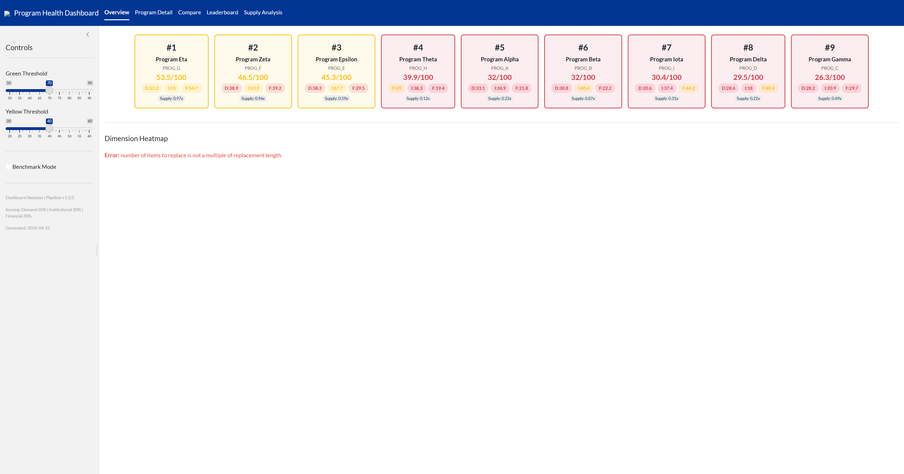
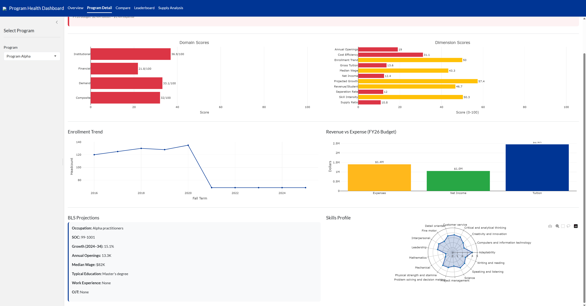
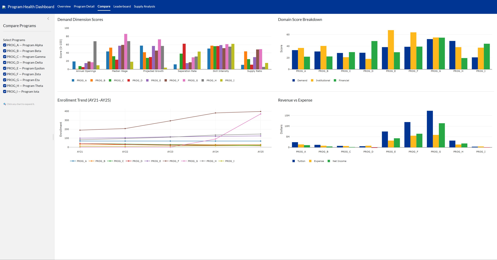
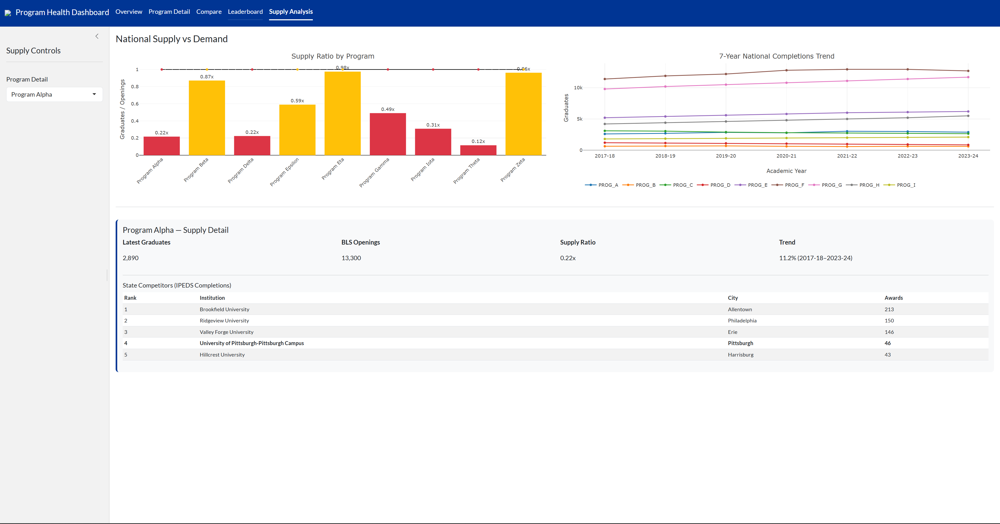

# Program Health Dashboard — Architecture Showcase

A **config-driven, multi-domain scoring dashboard** built as an MQE (Master of Quantitative Economics) capstone project at the University of Pittsburgh. This public repository demonstrates the architecture, scoring methodology, and engineering patterns — all data is **synthetic**.

  

---

## Screenshots

### Overview
Nine program tiles ranked by composite score with signal colors, domain badges, and supply ratio indicators.



### Supply Analysis
National supply ratio chart, 7-year completions trend, and state competitor tables from IPEDS data.




### Compare
Side-by-side program comparison across demand dimensions, domain scores, enrollment trends, and financials.



### Program Detail
Deep-dive into any program's metrics: domain scores, dimension breakdown, enrollment trends, financial P&L, BLS projections, and skills radar.



---

## What This Is

An interactive dashboard that scores and ranks academic programs across three domains:

| Domain | Weight | What It Measures |
|--------|--------|------------------|
| **Demand** | 50% | Labor market strength (BLS projections, wages, openings, skills, supply ratio) |
| **Institutional** | 30% | Internal program performance (enrollment trends, tuition revenue, revenue/student) |
| **Financial** | 20% | Program-level P&L health (net income, cost efficiency) |

Each program receives a 0–100 composite score and a signal: 🟢 Green (≥70), 🟡 Yellow (40–69), 🔴 Red (<40).

## Architecture: "The Sacred Wall"

```
YAML Config → Python Pipeline → pipeline_output.json → R Shiny Dashboard
   (edit)        (run once)         (the sacred wall)      (renders it)
```

**The dashboard NEVER calls Python.** It reads one JSON file. This decoupling means either side can be replaced independently — a different pipeline could produce the same JSON, or a different frontend could consume it.

## Quick Start

### Prerequisites
- R ≥ 4.2 with packages: `shiny`, `bslib`, `jsonlite`, `plotly`, `DT`
- (Optional) Python ≥ 3.10 for the pipeline skeleton

### Run the Dashboard
```bash
cd dashboard
Rscript -e "shiny::runApp('app.R', port=3838)"
```
Then open http://localhost:3838.

## Dashboard Features

### 5 Interactive Tabs

1. **Overview** — 9 program tiles with composite scores, signal colors, and domain badges. Adjustable signal thresholds via sliders. Dimension heatmap showing all 11 scored dimensions across all programs.

2. **Program Detail** — Deep-dive into any program: domain bars, dimension bars, enrollment trend, financial P&L, BLS projections, skills radar chart.

3. **Compare** — Side-by-side comparison with grouped bar charts for demand dimensions, domain scores, enrollment trends, and revenue vs expense. Click any chart to expand. Benchmark mode adds a dashed 100% reference line.

4. **Leaderboard** — Ranked table with sortable columns. External rankings section showing top-10 lists per ranked program category.

5. **Supply Analysis** — National supply ratio (graduates ÷ openings) bar chart, 7-year completions trend, and per-program detail with state competitor tables.

### Interactive Controls
- **Signal threshold sliders** — Adjust what score = green/yellow/red in real time
- **Benchmark mode** — Normalize all scores to one program = 100%
- **Click-to-zoom** — Expand any Compare or Supply chart into a full-width modal

## Scoring Methodology

### 11 Scored Dimensions

**Demand (6 dimensions):**
- Projected Growth (25%) — 10-year BLS employment change %
- Annual Openings (20%) — Total annual job openings (thousands)
- Median Wage (15%) — National median annual wage
- Separation Rate (15%) — Total occupational separations %
- Supply Ratio (15%) — IPEDS graduates ÷ BLS openings (inverted: lower = better)
- Skill Intensity (10%) — Average of 17 EP skill scores (1–5 scale)

**Institutional (3 dimensions):**
- Enrollment Trend (34%) — 4-year CAGR of headcount
- Gross Tuition (33%) — Total tuition revenue
- Revenue per Student (33%) — Tuition ÷ enrollment

**Financial (2 dimensions):**
- Net Income (50%) — Tuition minus expenses
- Cost Efficiency (50%) — Expenses ÷ tuition (inverted: lower = better)

### Normalization

Min-max linear interpolation against the **full BLS occupation range**, not just the scored programs:

```
score = ((value - min_anchor) / (max_anchor - min_anchor)) × 100, clamped to [0, 100]
```

## Key Design Decisions

1. **YAML config over hardcoded values** — Non-technical staff can update programs, weights, and data paths without touching code.

2. **The sacred wall (JSON)** — Decouples Python pipeline from R Shiny frontend. Either can be replaced independently.

3. **Full-range normalization anchors** — Prevents a small cohort from distorting relative rankings.

4. **Inverted normalization** for Cost Efficiency and Supply Ratio — Lower values are better for these metrics.

5. **50/30/20 domain weighting** — Demand is weighted highest because external market demand is the most objective and least controllable factor.

6. **Separate scoring engine from pipeline** — Re-score with different weights without re-extracting data.

## Repository Structure

```
MQE-Capstone/
├── dashboard/
│   ├── app.R                    # R Shiny dashboard (THE deliverable)
│   ├── data/
│   │   └── pipeline_output.json # Synthetic data (sacred wall)
│   └── www/                     # Static assets
├── config/                      # YAML configuration (skeleton)
├── src/                         # Python pipeline clients (skeleton)
├── data/                        # Raw data folders (empty — .gitkeep)
│   ├── bls/
│   └── internal/
├── README.md
└── requirements.txt
```

## How to Add a New Program

1. Add a new entry in `config/programs.yaml` with SOC codes, CIP codes, and program metadata
2. Add corresponding data to the internal data sources
3. Run the pipeline: `python run_pipeline.py` → `python scoring_engine.py`
4. The dashboard picks it up automatically from the updated JSON

## Technologies

- **R Shiny** with `bslib` (flatly theme), `plotly` (interactive charts), `DT` (sortable tables)
- **Python** pipeline with `openpyxl`, `PyYAML`
- **YAML** config-driven architecture
- **JSON** as the interface between pipeline and dashboard

## Credits

Built as an MQE Capstone project at the **University of Pittsburgh**, School of Health and Rehabilitation Sciences. This public repository contains only synthetic data for portfolio demonstration purposes.

---

*This dashboard demonstrates architecture and methodology. All program names, numbers, and institutional data are fabricated.*
**Author:** [Gabriel Penedo](https://gabrielpriante.github.io)
